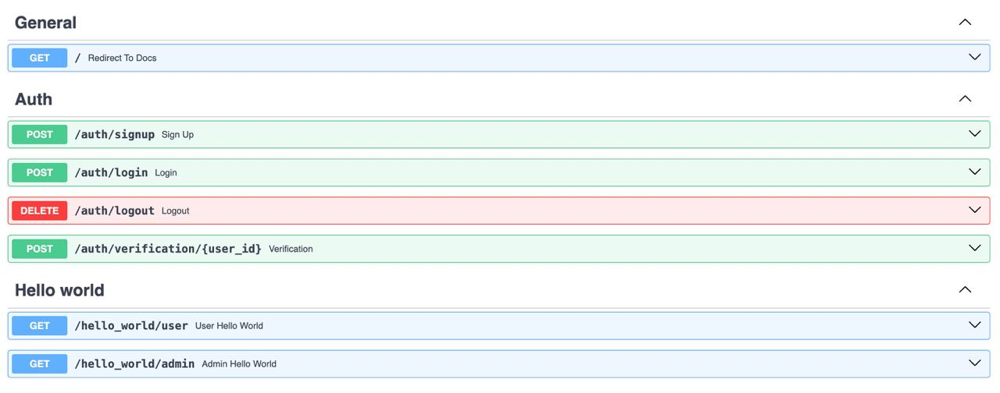
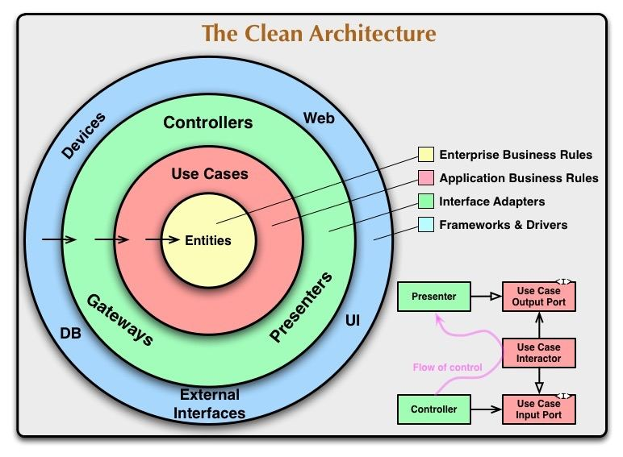

# Введение
Проект, реализующий работу с:
1. Web sessions
2. RBAC

# Проект
## Технологический стек
- **Python**: `3.12`
- **Production**: `alembic`, `dishka`, `fastapi`, `psycopg`, `sqlalchemy[async]`, `gunicorn`, `faststream[rabbit]`
- **Development**: `isort`, `ruff`, `pre-commit`


## API
<p align="center">
  
  <br><em>Handlers</em>
</p>

### General
- '/': Открыт для **всех**
   - Перенаправляет на Swagger документацию

### Auth (`/auth`)

- 'signup' (POST): Открыт для **всех**
  - Регистрация аккаунта
- 'login' (POST): Открыт для **всех**
  - Вход в аккаунт
- 'logout' (DELETE): Открыт для **всех**
  - Выход с аккаунта
- 'verification/{user_id}': Открыт для **всех**
  - Верификация аккаунта, проходя по ссылке из письма на почте

### Hello world (`/hello_world`)
- 'user' (GET): Открыт для **user**
  - return: Hello world by user
- 'admin' (GET): Открыт для **admin**
  - return: Hello world by admin

## Файловая структура

```
.
├── conf # конфиги
├── docs # документация
└── src
    └── auth
        ├── application # логика приложения и интерфейсы
        ├── domain # модели
        ├── entrypoint # настройка запуска
        ├── infrastructure # адаптеры
        └── presentation # внешнее общение

```

## Описание схем реляционной базы данных
Использован императивный подход. С помощью `map_imperatively` была смаплена доменная модель в представление базы данных.

## Зависимости
Приложение разделено на слои:
1. Domain
2. Application
3. Infrastructure
4. Presentation

<p align="center">
  
  <br><em>Чистая архитектура, Роберт Мартин</em>
</p>

- Соблюден принцип инверсии зависимотей
- Зависимости доставляются при помощи инъекции зависимостей, используя di-framework Dishka

## Переменные окружения
Для работы проекта необходимо настроить переменные окружения. В корне проекта подготовлены шаблоны:
- `.env.example` — используйте для локального запуска сервисов (localhost).
- `.env.docker.example` — используйте для запуска всего стека через Docker Compose.

Скопируйте нужный шаблон в соответствующий файл (`.env` или `.env.docker`) и заполните актуальные значения перед запуском.

## Как запустить
1. Склонируй проект
2. Заполни переменные окружения
3. Подними проект ``docker compose up --build``
4. Проведи миграции. Либо напрямую в контейнере, либо ``make migrate`` в терминале
5. Создай очередь в RabbitMQ под названием, которое установил в переменные окружения(RABBITMQ_EMAIL_SENDER_QUEUE)

## Полезные материалы
1. Web sessions - https://cheatsheetseries.owasp.org/cheatsheets/Session_Management_Cheat_Sheet.html
2. OAuth2 - https://auth0.com/docs и https://oauth.net/
